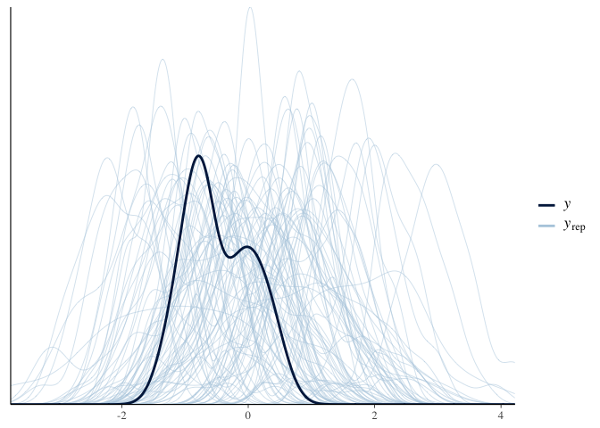
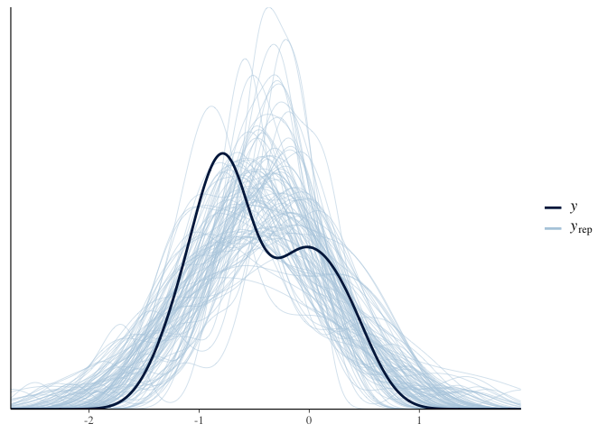
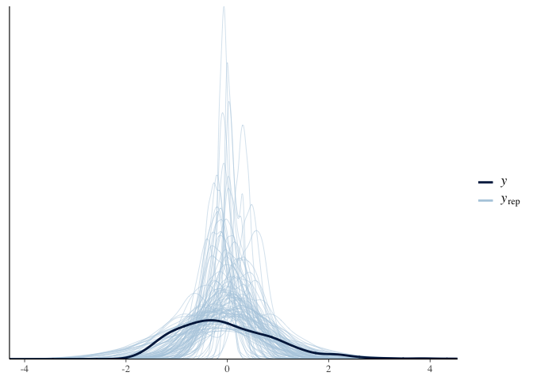
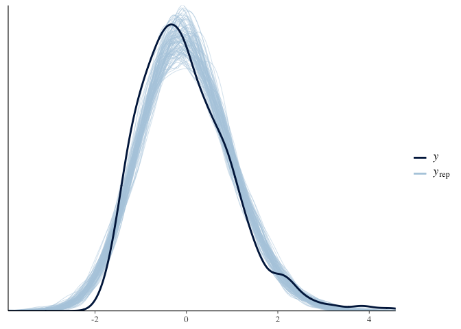
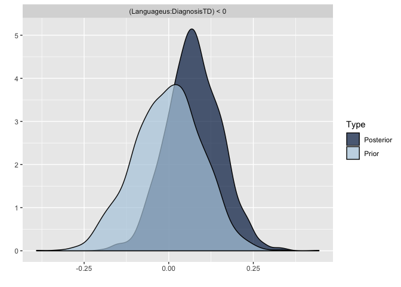
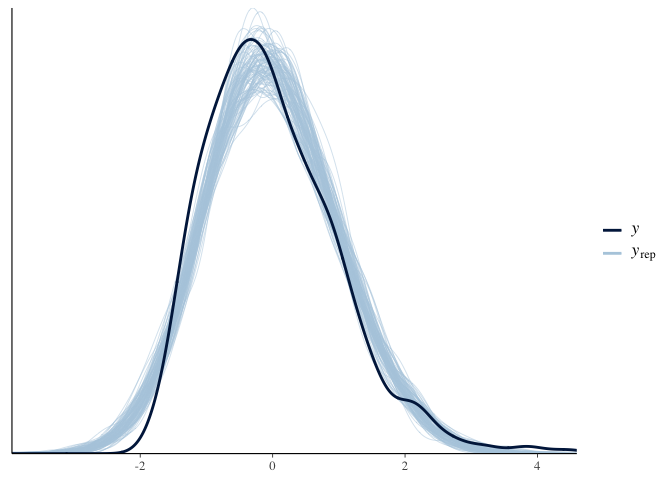
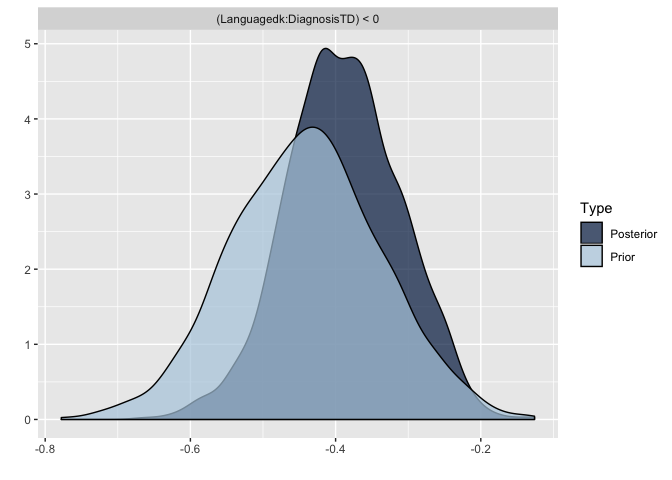
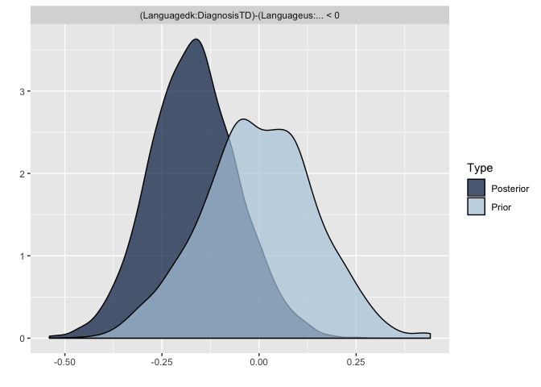
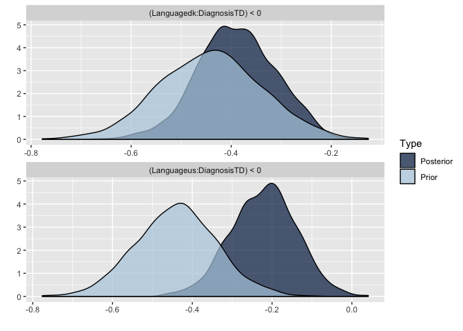

Assignment 4
------------

In this assignment we do the following: - we run a Bayesian
meta-analysis of pitch variability in ASD, based on previously published
literature - we analyze pitch variability in ASD in two new studies
using both a conservative and a meta-analytic prior - we assess the
difference in model quality and estimates using the two priors.

The questions you need to answer are: What are the consequences of using
a meta-analytic prior? Evaluate the models with conservative and
meta-analytic priors. Discuss the effects on estimates. Discuss the
effects on model quality. Discuss the role that meta-analytic priors
should have in scientific practice. Should we systematically use them?
Do they have drawbacks? Should we use them to complement more
conservative approaches? How does the use of meta-analytic priors you
suggest reflect the skeptical and cumulative nature of science?

### Step by step suggestions

Step 1: Perform a meta-analysis of pitch variability from previous
studies of voice in ASD - the data is available as
Ass4\_MetaAnalysisData.tsv - You should calculate Effect size (cohen’s
d) and Standard Error (uncertainty in the Cohen’s d) per each study,
using escalc() from the metafor package (also check the livecoding
intro) - N.B. we’re only interested in getting a meta-analytic effect
size for the meta-analytic prior (and not e.g. all the stuff on
publication bias). See a brms tutorial here:
<a href="https://vuorre.netlify.com/post/2016/09/29/meta-analysis-is-a-special-case-of-bayesian-multilevel-modeling/" class="uri">https://vuorre.netlify.com/post/2016/09/29/meta-analysis-is-a-special-case-of-bayesian-multilevel-modeling/</a>
The formula is EffectSize \| se(StandardError) \~ 1 + (1 \| Paper).
Don’t forget prior definition, model checking, etc. - Write down the
results of the meta-analysis in terms of a prior for step 2.

``` r
#calculate cohen's d + se 
#only want meta-analytic prior, so no worrying about other things
#effect size with uncertainty (se) and estimating metaanalaytic mean, given the uncertainty they have, and each paper different 

set.seed(5)

#LOAD DATA
MA_d <- read_delim("Ass4_MetaAnalysisData.tsv", delim = "\t")
```

    ## Parsed with column specification:
    ## cols(
    ##   .default = col_double(),
    ##   Paper = col_character(),
    ##   Author = col_character(),
    ##   Population = col_character(),
    ##   DiagnosisDetails = col_character(),
    ##   Language = col_character(),
    ##   Language2 = col_character(),
    ##   Task = col_character(),
    ##   Task2 = col_character(),
    ##   PitchMean_Units = col_character(),
    ##   PitchMeanASDvsTD = col_character(),
    ##   PitchRange_Units = col_character(),
    ##   PitchRangeASDvsTD = col_character(),
    ##   PitchSD_Units = col_character(),
    ##   PitchSDASDvsTD = col_character(),
    ##   PitchVariability_Units = col_character(),
    ##   PitchVariabilityASDvsTD = col_character(),
    ##   IntensityMean_Units = col_character(),
    ##   IntensityMeanASDvsTD = col_character(),
    ##   UtteranceDurationUnit = col_character(),
    ##   UtteranceDurationASDvsTD = col_character()
    ##   # ... with 5 more columns
    ## )

    ## See spec(...) for full column specifications.

``` r
#some papers are repeated becasue 2 different studies/populations
#diffferent studies might also work through the same population/data
#dont differentiate between hz and logscale

#CLEAN DATA
#turn pitch var from character into numeric 
MA_d <- MA_d %>% 
  mutate(
    PitchVariabilityASD_Mean = as.numeric(PitchVariabilityASD_Mean),
    PitchVariabilityTD_Mean = as.numeric(PitchVariabilityTD_Mean),
    PitchVariabilityASD_SD = as.numeric(PitchVariabilityASD_SD),
    PitchVariabilityTD_SD = as.numeric(PitchVariabilityTD_SD)
  )

#delete rows with NAs
MA_d <- MA_d %>% subset(!is.na(Paper))

#CALCULATE EFFECT SIZE
#do escalc to get efect size 
#calculate effect size for each study (slab)
#smd = standardised mean difference (cohens d)
#TD-ASD - negative value = ASD bigger pitch variability
MA_d <- escalc(measure = "SMD",
            n1i = TD_N,
            n2i = ASD_N,
            m1i = PitchVariabilityTD_Mean,
            m2i = PitchVariabilityASD_Mean,
            sd1i = PitchVariabilityTD_SD,
            sd2i = PitchVariabilityASD_SD,
            data = MA_d,
            slab = Paper)
            
#calculate standard error sqrt(sd) and renaming effect size
MA_d <- MA_d %>% 
  mutate(StandardError = sqrt(vi)) %>% 
  rename(EffectSize = yi)

#check up: get mean effect size and standard error
summary(MA_d$EffectSize)
```

    ##     Min.  1st Qu.   Median     Mean  3rd Qu.     Max.     NA's 
    ## -1.29110 -0.81658 -0.65338 -0.46315 -0.05907  0.52031       11

``` r
summary(MA_d$StandardError)
```

    ##    Min. 1st Qu.  Median    Mean 3rd Qu.    Max.    NA's 
    ##  0.2211  0.3176  0.3732  0.3673  0.4243  0.4826      11

``` r
#CALCULATE META-ANALYTIC EFFECT SIZE
#fixed effect ~ 1 becasue we want a mean  
#varying effects: population varying effect, different data sets
#outcome is not to be taken at face value but take into account the standard error
MA_f <- bf(EffectSize | se(StandardError) ~ 1 + (1|Population))

#get prior
get_prior(MA_f, data = MA_d, family = gaussian)
```

    ## Warning: Rows containing NAs were excluded from the model.

    ##                  prior     class      coef      group resp dpar nlpar bound
    ## 1 student_t(3, -1, 10) Intercept                                           
    ## 2  student_t(3, 0, 10)        sd                                           
    ## 3                             sd           Population                      
    ## 4                             sd Intercept Population

``` r
sd(MA_d$EffectSize, na.rm = T)
```

    ## [1] 0.5163518

``` r
#define prior
MA_prior <- c(
  prior(normal(0,1), class = Intercept),
  prior(normal(0,.3), class = sd)
)

#prior model 
MA_m0 <- brm(
  MA_f,
  data = MA_d,
  family = gaussian(),
  prior = MA_prior,
  sample_prior = "only",
  chain = 2,
  cores = 2
)
```

    ## Warning: Rows containing NAs were excluded from the model.

    ## Compiling the C++ model

    ## Trying to compile a simple C file

    ## Running /Library/Frameworks/R.framework/Resources/bin/R CMD SHLIB foo.c
    ## clang -I"/Library/Frameworks/R.framework/Resources/include" -DNDEBUG   -I"/Users/nicoledwenger/Library/R/3.6/library/Rcpp/include/"  -I"/Users/nicoledwenger/Library/R/3.6/library/RcppEigen/include/"  -I"/Users/nicoledwenger/Library/R/3.6/library/RcppEigen/include/unsupported"  -I"/Users/nicoledwenger/Library/R/3.6/library/BH/include" -I"/Users/nicoledwenger/Library/R/3.6/library/StanHeaders/include/src/"  -I"/Users/nicoledwenger/Library/R/3.6/library/StanHeaders/include/"  -I"/Users/nicoledwenger/Library/R/3.6/library/rstan/include" -DEIGEN_NO_DEBUG  -D_REENTRANT  -DBOOST_DISABLE_ASSERTS -DBOOST_PENDING_INTEGER_LOG2_HPP -include stan/math/prim/mat/fun/Eigen.hpp   -isysroot /Library/Developer/CommandLineTools/SDKs/MacOSX.sdk -I/usr/local/include  -fPIC  -isysroot /Library/Developer/CommandLineTools/SDKs/MacOSX.sdk -c foo.c -o foo.o
    ## In file included from <built-in>:1:
    ## In file included from /Users/nicoledwenger/Library/R/3.6/library/StanHeaders/include/stan/math/prim/mat/fun/Eigen.hpp:13:
    ## In file included from /Users/nicoledwenger/Library/R/3.6/library/RcppEigen/include/Eigen/Dense:1:
    ## In file included from /Users/nicoledwenger/Library/R/3.6/library/RcppEigen/include/Eigen/Core:88:
    ## /Users/nicoledwenger/Library/R/3.6/library/RcppEigen/include/Eigen/src/Core/util/Macros.h:613:1: error: unknown type name 'namespace'
    ## namespace Eigen {
    ## ^
    ## /Users/nicoledwenger/Library/R/3.6/library/RcppEigen/include/Eigen/src/Core/util/Macros.h:613:16: error: expected ';' after top level declarator
    ## namespace Eigen {
    ##                ^
    ##                ;
    ## In file included from <built-in>:1:
    ## In file included from /Users/nicoledwenger/Library/R/3.6/library/StanHeaders/include/stan/math/prim/mat/fun/Eigen.hpp:13:
    ## In file included from /Users/nicoledwenger/Library/R/3.6/library/RcppEigen/include/Eigen/Dense:1:
    ## /Users/nicoledwenger/Library/R/3.6/library/RcppEigen/include/Eigen/Core:96:10: fatal error: 'complex' file not found
    ## #include <complex>
    ##          ^~~~~~~~~
    ## 3 errors generated.
    ## make: *** [foo.o] Error 1

    ## Start sampling

``` r
#prior check
pp_check(MA_m0, nsamples = 100)
```



``` r
#real model
MA_m1 <- brm(
  MA_f,
  data = MA_d,
  family = gaussian(),
  prior = MA_prior,
  sample_prior = T,
  chain = 2,
  cores = 2
)
```

    ## Warning: Rows containing NAs were excluded from the model.

    ## Compiling the C++ model
    ## Trying to compile a simple C file

    ## Running /Library/Frameworks/R.framework/Resources/bin/R CMD SHLIB foo.c
    ## clang -I"/Library/Frameworks/R.framework/Resources/include" -DNDEBUG   -I"/Users/nicoledwenger/Library/R/3.6/library/Rcpp/include/"  -I"/Users/nicoledwenger/Library/R/3.6/library/RcppEigen/include/"  -I"/Users/nicoledwenger/Library/R/3.6/library/RcppEigen/include/unsupported"  -I"/Users/nicoledwenger/Library/R/3.6/library/BH/include" -I"/Users/nicoledwenger/Library/R/3.6/library/StanHeaders/include/src/"  -I"/Users/nicoledwenger/Library/R/3.6/library/StanHeaders/include/"  -I"/Users/nicoledwenger/Library/R/3.6/library/rstan/include" -DEIGEN_NO_DEBUG  -D_REENTRANT  -DBOOST_DISABLE_ASSERTS -DBOOST_PENDING_INTEGER_LOG2_HPP -include stan/math/prim/mat/fun/Eigen.hpp   -isysroot /Library/Developer/CommandLineTools/SDKs/MacOSX.sdk -I/usr/local/include  -fPIC  -isysroot /Library/Developer/CommandLineTools/SDKs/MacOSX.sdk -c foo.c -o foo.o
    ## In file included from <built-in>:1:
    ## In file included from /Users/nicoledwenger/Library/R/3.6/library/StanHeaders/include/stan/math/prim/mat/fun/Eigen.hpp:13:
    ## In file included from /Users/nicoledwenger/Library/R/3.6/library/RcppEigen/include/Eigen/Dense:1:
    ## In file included from /Users/nicoledwenger/Library/R/3.6/library/RcppEigen/include/Eigen/Core:88:
    ## /Users/nicoledwenger/Library/R/3.6/library/RcppEigen/include/Eigen/src/Core/util/Macros.h:613:1: error: unknown type name 'namespace'
    ## namespace Eigen {
    ## ^
    ## /Users/nicoledwenger/Library/R/3.6/library/RcppEigen/include/Eigen/src/Core/util/Macros.h:613:16: error: expected ';' after top level declarator
    ## namespace Eigen {
    ##                ^
    ##                ;
    ## In file included from <built-in>:1:
    ## In file included from /Users/nicoledwenger/Library/R/3.6/library/StanHeaders/include/stan/math/prim/mat/fun/Eigen.hpp:13:
    ## In file included from /Users/nicoledwenger/Library/R/3.6/library/RcppEigen/include/Eigen/Dense:1:
    ## /Users/nicoledwenger/Library/R/3.6/library/RcppEigen/include/Eigen/Core:96:10: fatal error: 'complex' file not found
    ## #include <complex>
    ##          ^~~~~~~~~
    ## 3 errors generated.
    ## make: *** [foo.o] Error 1

    ## Start sampling

``` r
#posterior check
pp_check(MA_m1, nsamples = 100)
```



``` r
#model summary
summary(MA_m1)
```

    ##  Family: gaussian 
    ##   Links: mu = identity; sigma = identity 
    ## Formula: EffectSize | se(StandardError) ~ 1 + (1 | Population) 
    ##    Data: MA_d (Number of observations: 30) 
    ## Samples: 2 chains, each with iter = 2000; warmup = 1000; thin = 1;
    ##          total post-warmup samples = 2000
    ## 
    ## Group-Level Effects: 
    ## ~Population (Number of levels: 26) 
    ##               Estimate Est.Error l-95% CI u-95% CI Rhat Bulk_ESS Tail_ESS
    ## sd(Intercept)     0.33      0.10     0.13     0.53 1.00      602      608
    ## 
    ## Population-Level Effects: 
    ##           Estimate Est.Error l-95% CI u-95% CI Rhat Bulk_ESS Tail_ESS
    ## Intercept    -0.44      0.09    -0.62    -0.26 1.00     1184     1156
    ## 
    ## Samples were drawn using sampling(NUTS). For each parameter, Bulk_ESS
    ## and Tail_ESS are effective sample size measures, and Rhat is the potential
    ## scale reduction factor on split chains (at convergence, Rhat = 1).

``` r
#save values
#MA mean = 0.44
MA_mean = fixef(MA_m1)[1]
#MA sd = 0.1
MA_sd = fixef(MA_m1)[2]
#MA heterogeneity, i.e. difference = 0.32
MA_hetero = 0.32
```

Step 2: Analyse pitch variability in ASD in two new studies for which
you have access to all the trials (not just study level estimates) - the
data is available as Ass4\_data.csv. Notice there are 2 studies
(language us, and language dk), multiple trials per participant, and a
few different ways to measure pitch variability (if in doubt, focus on
pitch IQR, interquartile range of the log of fundamental frequency) -
Also, let’s standardize the data, so that they are compatible with our
meta-analytic prior (Cohen’s d is measured in SDs). - Is there any
structure in the dataset that we should account for with random/varying
effects? How would you implement that? Or, if you don’t know how to do
bayesian random/varying effects or don’t want to bother, is there
anything we would need to simplify in the dataset?

``` r
#how should we analyse them
#how should we include the metaanalytic prior
#what difference does it make
#more robust is pitch variability, but can use others? 
#cohens d measured in sd - so standardise the data
#make sure you look at structure in the data (2studies, trials pp, )

#LOAD DATA
d <- read_csv("Ass4_data.csv", col_types = cols(ID = col_character()))

#SCALE
d <- d %>% 
  mutate(
    PitchVariability = scale(Pitch_IQR)
  )

#CHECK
hist(d$Pitch_IQR)
```


``` r
hist(d$PitchVariability)
```


``` r
#structure in the data 
#different languages (d, e) - Fixed Effect
#id, each participant included several times, becasue going through different trials - Varying effect
```

Step 3: Build a regression model predicting Pitch variability from
Diagnosis. - how is the outcome distributed? (likelihood function). NB.
given we are standardizing, and the meta-analysis is on that scale,
gaussian is not a bad assumption. Lognormal would require us to convert
the prior to that scale. - how are the parameters of the likelihood
distribution distributed? Which predictors should they be conditioned
on? Start simple, with Diagnosis only. Add other predictors only if you
have the time and energy! - use a skeptical/conservative prior for the
effects of diagnosis. Remember you’ll need to motivate it. - Evaluate
model quality. Describe and plot the estimates.

``` r
#actually want to build the model predicting pitchvariability from diagnosis 
#whether they is a difference
#describe how the outcome is distirbuted
#describe how the parameters of the likelihood is distributed, in which way is the mean effected by predictiors
#motivate it = need to explain why you are choosing one mean or the other and what consequences that has - before looking at the data
#evaluate model!


#MODELS
#without language: pitch variability is different in the ASD and TD and different individuals will show different variability.
#i.e. hypotheiss that difference in languge makes no difference
NS_f0 <- bf(PitchVariability ~ 1 + Diagnosis + (1|ID))
#with language: 
NS_f1 <- bf(PitchVariability ~ 0 + Language + Language:Diagnosis + (1|ID))
#the two languages have both their own intercept when diagnosis is ASD, and diagnosis is going to make a difference, effect of language by diagnosis

#WITHOUT LANGUAGE
get_prior(NS_f0, d, family = gaussian)
```

    ##                 prior     class        coef group resp dpar nlpar bound
    ## 1                             b                                        
    ## 2                             b DiagnosisTD                            
    ## 3 student_t(3, 0, 10) Intercept                                        
    ## 4 student_t(3, 0, 10)        sd                                        
    ## 5                            sd                ID                      
    ## 6                            sd   Intercept    ID                      
    ## 7 student_t(3, 0, 10)     sigma

``` r
#beta (effect of diganosis TD compared to ASD),
#intercept (average for ASD)
#sd (variability for participant)
#sigma (error we expect that the model makes on a given data point)

NS_prior0 <- c(
  prior(normal(0, .3), class = Intercept), #ASD, average pitch var for asds 
  prior(normal(0, .1), class = b), #expacting a small difference, sceptical prior
  prior(normal(0, .1), class = sd), #no big difference for participants from the mean, not bigger than difference between diagnosis
  prior(normal(.5, .3), class = sigma) #lower boundry of 0, don't expect the error to be 0, is already default 
)

NS_0_priorcheck <- brm(
  NS_f0, 
  d,
  family = gaussian(),
  prior = NS_prior0,
  sample_prior = "only",
  chains = 2,
  cores = 2
) 
```

    ## Compiling the C++ model

    ## Trying to compile a simple C file

    ## Running /Library/Frameworks/R.framework/Resources/bin/R CMD SHLIB foo.c
    ## clang -I"/Library/Frameworks/R.framework/Resources/include" -DNDEBUG   -I"/Users/nicoledwenger/Library/R/3.6/library/Rcpp/include/"  -I"/Users/nicoledwenger/Library/R/3.6/library/RcppEigen/include/"  -I"/Users/nicoledwenger/Library/R/3.6/library/RcppEigen/include/unsupported"  -I"/Users/nicoledwenger/Library/R/3.6/library/BH/include" -I"/Users/nicoledwenger/Library/R/3.6/library/StanHeaders/include/src/"  -I"/Users/nicoledwenger/Library/R/3.6/library/StanHeaders/include/"  -I"/Users/nicoledwenger/Library/R/3.6/library/rstan/include" -DEIGEN_NO_DEBUG  -D_REENTRANT  -DBOOST_DISABLE_ASSERTS -DBOOST_PENDING_INTEGER_LOG2_HPP -include stan/math/prim/mat/fun/Eigen.hpp   -isysroot /Library/Developer/CommandLineTools/SDKs/MacOSX.sdk -I/usr/local/include  -fPIC  -isysroot /Library/Developer/CommandLineTools/SDKs/MacOSX.sdk -c foo.c -o foo.o
    ## In file included from <built-in>:1:
    ## In file included from /Users/nicoledwenger/Library/R/3.6/library/StanHeaders/include/stan/math/prim/mat/fun/Eigen.hpp:13:
    ## In file included from /Users/nicoledwenger/Library/R/3.6/library/RcppEigen/include/Eigen/Dense:1:
    ## In file included from /Users/nicoledwenger/Library/R/3.6/library/RcppEigen/include/Eigen/Core:88:
    ## /Users/nicoledwenger/Library/R/3.6/library/RcppEigen/include/Eigen/src/Core/util/Macros.h:613:1: error: unknown type name 'namespace'
    ## namespace Eigen {
    ## ^
    ## /Users/nicoledwenger/Library/R/3.6/library/RcppEigen/include/Eigen/src/Core/util/Macros.h:613:16: error: expected ';' after top level declarator
    ## namespace Eigen {
    ##                ^
    ##                ;
    ## In file included from <built-in>:1:
    ## In file included from /Users/nicoledwenger/Library/R/3.6/library/StanHeaders/include/stan/math/prim/mat/fun/Eigen.hpp:13:
    ## In file included from /Users/nicoledwenger/Library/R/3.6/library/RcppEigen/include/Eigen/Dense:1:
    ## /Users/nicoledwenger/Library/R/3.6/library/RcppEigen/include/Eigen/Core:96:10: fatal error: 'complex' file not found
    ## #include <complex>
    ##          ^~~~~~~~~
    ## 3 errors generated.
    ## make: *** [foo.o] Error 1

    ## Start sampling

``` r
pp_check(NS_0_priorcheck, nsamples = 100)
```


``` r
#actual model
NS_m0 <- brm(
  NS_f0, 
  d,
  family = gaussian(),
  prior = NS_prior0,
  sample_prior = T,
  chains = 2,
  cores = 2
) 
```

    ## Compiling the C++ model
    ## Trying to compile a simple C file

    ## Running /Library/Frameworks/R.framework/Resources/bin/R CMD SHLIB foo.c
    ## clang -I"/Library/Frameworks/R.framework/Resources/include" -DNDEBUG   -I"/Users/nicoledwenger/Library/R/3.6/library/Rcpp/include/"  -I"/Users/nicoledwenger/Library/R/3.6/library/RcppEigen/include/"  -I"/Users/nicoledwenger/Library/R/3.6/library/RcppEigen/include/unsupported"  -I"/Users/nicoledwenger/Library/R/3.6/library/BH/include" -I"/Users/nicoledwenger/Library/R/3.6/library/StanHeaders/include/src/"  -I"/Users/nicoledwenger/Library/R/3.6/library/StanHeaders/include/"  -I"/Users/nicoledwenger/Library/R/3.6/library/rstan/include" -DEIGEN_NO_DEBUG  -D_REENTRANT  -DBOOST_DISABLE_ASSERTS -DBOOST_PENDING_INTEGER_LOG2_HPP -include stan/math/prim/mat/fun/Eigen.hpp   -isysroot /Library/Developer/CommandLineTools/SDKs/MacOSX.sdk -I/usr/local/include  -fPIC  -isysroot /Library/Developer/CommandLineTools/SDKs/MacOSX.sdk -c foo.c -o foo.o
    ## In file included from <built-in>:1:
    ## In file included from /Users/nicoledwenger/Library/R/3.6/library/StanHeaders/include/stan/math/prim/mat/fun/Eigen.hpp:13:
    ## In file included from /Users/nicoledwenger/Library/R/3.6/library/RcppEigen/include/Eigen/Dense:1:
    ## In file included from /Users/nicoledwenger/Library/R/3.6/library/RcppEigen/include/Eigen/Core:88:
    ## /Users/nicoledwenger/Library/R/3.6/library/RcppEigen/include/Eigen/src/Core/util/Macros.h:613:1: error: unknown type name 'namespace'
    ## namespace Eigen {
    ## ^
    ## /Users/nicoledwenger/Library/R/3.6/library/RcppEigen/include/Eigen/src/Core/util/Macros.h:613:16: error: expected ';' after top level declarator
    ## namespace Eigen {
    ##                ^
    ##                ;
    ## In file included from <built-in>:1:
    ## In file included from /Users/nicoledwenger/Library/R/3.6/library/StanHeaders/include/stan/math/prim/mat/fun/Eigen.hpp:13:
    ## In file included from /Users/nicoledwenger/Library/R/3.6/library/RcppEigen/include/Eigen/Dense:1:
    ## /Users/nicoledwenger/Library/R/3.6/library/RcppEigen/include/Eigen/Core:96:10: fatal error: 'complex' file not found
    ## #include <complex>
    ##          ^~~~~~~~~
    ## 3 errors generated.
    ## make: *** [foo.o] Error 1

    ## Start sampling

``` r
pp_check(NS_m0, nsamples = 100)
```


``` r
#output + checks
summary(NS_m0)
```

    ##  Family: gaussian 
    ##   Links: mu = identity; sigma = identity 
    ## Formula: PitchVariability ~ 1 + Diagnosis + (1 | ID) 
    ##    Data: d (Number of observations: 1074) 
    ## Samples: 2 chains, each with iter = 2000; warmup = 1000; thin = 1;
    ##          total post-warmup samples = 2000
    ## 
    ## Group-Level Effects: 
    ## ~ID (Number of levels: 149) 
    ##               Estimate Est.Error l-95% CI u-95% CI Rhat Bulk_ESS Tail_ESS
    ## sd(Intercept)     0.64      0.03     0.57     0.71 1.00      843     1341
    ## 
    ## Population-Level Effects: 
    ##             Estimate Est.Error l-95% CI u-95% CI Rhat Bulk_ESS Tail_ESS
    ## Intercept       0.26      0.07     0.13     0.39 1.00      601     1131
    ## DiagnosisTD    -0.09      0.08    -0.24     0.06 1.00      942      976
    ## 
    ## Family Specific Parameters: 
    ##       Estimate Est.Error l-95% CI u-95% CI Rhat Bulk_ESS Tail_ESS
    ## sigma     0.70      0.02     0.67     0.74 1.00     2266     1585
    ## 
    ## Samples were drawn using sampling(NUTS). For each parameter, Bulk_ESS
    ## and Tail_ESS are effective sample size measures, and Rhat is the potential
    ## scale reduction factor on split chains (at convergence, Rhat = 1).

``` r
#credible evidence that the difference is there, but not that strong and difference is small 
#intercept (asd) at 0.26 and td's are slightly lower (-0.08)

#hyothesis that td has lower pitch var (based on meta analysis)
hypothesis(NS_m0, "DiagnosisTD < 0")
```

    ## Hypothesis Tests for class b:
    ##          Hypothesis Estimate Est.Error CI.Lower CI.Upper Evid.Ratio Post.Prob
    ## 1 (DiagnosisTD) < 0    -0.09      0.08    -0.21     0.04       6.81      0.87
    ##   Star
    ## 1     
    ## ---
    ## 'CI': 90%-CI for one-sided and 95%-CI for two-sided hypotheses.
    ## '*': For one-sided hypotheses, the posterior probability exceeds 95%;
    ## for two-sided hypotheses, the value tested against lies outside the 95%-CI.
    ## Posterior probabilities of point hypotheses assume equal prior probabilities.

``` r
plot(hypothesis(NS_m0, "DiagnosisTD < 0"))
```


``` r
#model has learned a bit


#WITH LANGUAGE
#NS_f1 <- bf(PitchVariability ~ 0 + Language + Language:Diagnosis + (1|ID))
get_prior(NS_f1, d, family = gaussian)
```

    ##                 prior class                   coef group resp dpar nlpar bound
    ## 1                         b                                                   
    ## 2                         b             Languagedk                            
    ## 3                         b Languagedk:DiagnosisTD                            
    ## 4                         b             Languageus                            
    ## 5                         b Languageus:DiagnosisTD                            
    ## 6 student_t(3, 0, 10)    sd                                                   
    ## 7                        sd                           ID                      
    ## 8                        sd              Intercept    ID                      
    ## 9 student_t(3, 0, 10) sigma

``` r
#two intercept by language
#two slopes by language = difference that diagnosis makes in the first and second language

NS_prior1 <- c(
  prior(normal(0, .3), class = b, coef = "Languagedk"), #intercept dk (asd), scaled so close to 0, 
  prior(normal(0, .3), class = b, coef = "Languageus"), #intecept us (asd)
  prior(normal(0, .1), class = b, coef = Languagedk:DiagnosisTD), #effect of diagnosis in dk
  prior(normal(0, .1), class = b, coef = Languageus:DiagnosisTD), #effect of diagnosis in us
  prior(normal(0, .1), class = sd), 
  prior(normal(.5, .3), class = sigma)
)

NS_1_priorcheck <- brm(
  NS_f1, 
  d,
  family = gaussian(),
  prior = NS_prior1,
  sample_prior = "only",
  chains = 2,
  cores = 2
)  
```

    ## Compiling the C++ model
    ## Trying to compile a simple C file

    ## Running /Library/Frameworks/R.framework/Resources/bin/R CMD SHLIB foo.c
    ## clang -I"/Library/Frameworks/R.framework/Resources/include" -DNDEBUG   -I"/Users/nicoledwenger/Library/R/3.6/library/Rcpp/include/"  -I"/Users/nicoledwenger/Library/R/3.6/library/RcppEigen/include/"  -I"/Users/nicoledwenger/Library/R/3.6/library/RcppEigen/include/unsupported"  -I"/Users/nicoledwenger/Library/R/3.6/library/BH/include" -I"/Users/nicoledwenger/Library/R/3.6/library/StanHeaders/include/src/"  -I"/Users/nicoledwenger/Library/R/3.6/library/StanHeaders/include/"  -I"/Users/nicoledwenger/Library/R/3.6/library/rstan/include" -DEIGEN_NO_DEBUG  -D_REENTRANT  -DBOOST_DISABLE_ASSERTS -DBOOST_PENDING_INTEGER_LOG2_HPP -include stan/math/prim/mat/fun/Eigen.hpp   -isysroot /Library/Developer/CommandLineTools/SDKs/MacOSX.sdk -I/usr/local/include  -fPIC  -isysroot /Library/Developer/CommandLineTools/SDKs/MacOSX.sdk -c foo.c -o foo.o
    ## In file included from <built-in>:1:
    ## In file included from /Users/nicoledwenger/Library/R/3.6/library/StanHeaders/include/stan/math/prim/mat/fun/Eigen.hpp:13:
    ## In file included from /Users/nicoledwenger/Library/R/3.6/library/RcppEigen/include/Eigen/Dense:1:
    ## In file included from /Users/nicoledwenger/Library/R/3.6/library/RcppEigen/include/Eigen/Core:88:
    ## /Users/nicoledwenger/Library/R/3.6/library/RcppEigen/include/Eigen/src/Core/util/Macros.h:613:1: error: unknown type name 'namespace'
    ## namespace Eigen {
    ## ^
    ## /Users/nicoledwenger/Library/R/3.6/library/RcppEigen/include/Eigen/src/Core/util/Macros.h:613:16: error: expected ';' after top level declarator
    ## namespace Eigen {
    ##                ^
    ##                ;
    ## In file included from <built-in>:1:
    ## In file included from /Users/nicoledwenger/Library/R/3.6/library/StanHeaders/include/stan/math/prim/mat/fun/Eigen.hpp:13:
    ## In file included from /Users/nicoledwenger/Library/R/3.6/library/RcppEigen/include/Eigen/Dense:1:
    ## /Users/nicoledwenger/Library/R/3.6/library/RcppEigen/include/Eigen/Core:96:10: fatal error: 'complex' file not found
    ## #include <complex>
    ##          ^~~~~~~~~
    ## 3 errors generated.
    ## make: *** [foo.o] Error 1

    ## Start sampling

``` r
pp_check(NS_1_priorcheck, nsamples = 100)
```



``` r
NS_m1 <- brm(
  NS_f1, 
  d,
  family = gaussian(),
  prior = NS_prior1,
  sample_prior = T,
  chains = 2,
  cores = 2
) 
```

    ## Compiling the C++ model
    ## Trying to compile a simple C file

    ## Running /Library/Frameworks/R.framework/Resources/bin/R CMD SHLIB foo.c
    ## clang -I"/Library/Frameworks/R.framework/Resources/include" -DNDEBUG   -I"/Users/nicoledwenger/Library/R/3.6/library/Rcpp/include/"  -I"/Users/nicoledwenger/Library/R/3.6/library/RcppEigen/include/"  -I"/Users/nicoledwenger/Library/R/3.6/library/RcppEigen/include/unsupported"  -I"/Users/nicoledwenger/Library/R/3.6/library/BH/include" -I"/Users/nicoledwenger/Library/R/3.6/library/StanHeaders/include/src/"  -I"/Users/nicoledwenger/Library/R/3.6/library/StanHeaders/include/"  -I"/Users/nicoledwenger/Library/R/3.6/library/rstan/include" -DEIGEN_NO_DEBUG  -D_REENTRANT  -DBOOST_DISABLE_ASSERTS -DBOOST_PENDING_INTEGER_LOG2_HPP -include stan/math/prim/mat/fun/Eigen.hpp   -isysroot /Library/Developer/CommandLineTools/SDKs/MacOSX.sdk -I/usr/local/include  -fPIC  -isysroot /Library/Developer/CommandLineTools/SDKs/MacOSX.sdk -c foo.c -o foo.o
    ## In file included from <built-in>:1:
    ## In file included from /Users/nicoledwenger/Library/R/3.6/library/StanHeaders/include/stan/math/prim/mat/fun/Eigen.hpp:13:
    ## In file included from /Users/nicoledwenger/Library/R/3.6/library/RcppEigen/include/Eigen/Dense:1:
    ## In file included from /Users/nicoledwenger/Library/R/3.6/library/RcppEigen/include/Eigen/Core:88:
    ## /Users/nicoledwenger/Library/R/3.6/library/RcppEigen/include/Eigen/src/Core/util/Macros.h:613:1: error: unknown type name 'namespace'
    ## namespace Eigen {
    ## ^
    ## /Users/nicoledwenger/Library/R/3.6/library/RcppEigen/include/Eigen/src/Core/util/Macros.h:613:16: error: expected ';' after top level declarator
    ## namespace Eigen {
    ##                ^
    ##                ;
    ## In file included from <built-in>:1:
    ## In file included from /Users/nicoledwenger/Library/R/3.6/library/StanHeaders/include/stan/math/prim/mat/fun/Eigen.hpp:13:
    ## In file included from /Users/nicoledwenger/Library/R/3.6/library/RcppEigen/include/Eigen/Dense:1:
    ## /Users/nicoledwenger/Library/R/3.6/library/RcppEigen/include/Eigen/Core:96:10: fatal error: 'complex' file not found
    ## #include <complex>
    ##          ^~~~~~~~~
    ## 3 errors generated.
    ## make: *** [foo.o] Error 1

    ## Start sampling

``` r
pp_check(NS_m1, nsamples = 100)
```



``` r
#output + checks
summary(NS_m1)
```

    ##  Family: gaussian 
    ##   Links: mu = identity; sigma = identity 
    ## Formula: PitchVariability ~ 0 + Language + Language:Diagnosis + (1 | ID) 
    ##    Data: d (Number of observations: 1074) 
    ## Samples: 2 chains, each with iter = 2000; warmup = 1000; thin = 1;
    ##          total post-warmup samples = 2000
    ## 
    ## Group-Level Effects: 
    ## ~ID (Number of levels: 149) 
    ##               Estimate Est.Error l-95% CI u-95% CI Rhat Bulk_ESS Tail_ESS
    ## sd(Intercept)     0.50      0.03     0.44     0.57 1.00      827     1443
    ## 
    ## Population-Level Effects: 
    ##                        Estimate Est.Error l-95% CI u-95% CI Rhat Bulk_ESS
    ## Languagedk                -0.21      0.08    -0.37    -0.06 1.00      405
    ## Languageus                 0.65      0.07     0.51     0.79 1.00     1225
    ## Languagedk:DiagnosisTD    -0.10      0.08    -0.26     0.04 1.00      985
    ## Languageus:DiagnosisTD     0.07      0.08    -0.09     0.23 1.00     1759
    ##                        Tail_ESS
    ## Languagedk                  841
    ## Languageus                 1418
    ## Languagedk:DiagnosisTD     1275
    ## Languageus:DiagnosisTD     1616
    ## 
    ## Family Specific Parameters: 
    ##       Estimate Est.Error l-95% CI u-95% CI Rhat Bulk_ESS Tail_ESS
    ## sigma     0.71      0.02     0.67     0.74 1.00     1805     1725
    ## 
    ## Samples were drawn using sampling(NUTS). For each parameter, Bulk_ESS
    ## and Tail_ESS are effective sample size measures, and Rhat is the potential
    ## scale reduction factor on split chains (at convergence, Rhat = 1).

``` r
#effects in languages in opposite directions
#languagedk: danish asd 
#language us: us asd 
#different directions 

#for language dk td has lower var
hypothesis(NS_m1, "Languagedk:DiagnosisTD < 0")
```

    ## Hypothesis Tests for class b:
    ##                 Hypothesis Estimate Est.Error CI.Lower CI.Upper Evid.Ratio
    ## 1 (Languagedk:Diagn... < 0     -0.1      0.08    -0.23     0.02       9.99
    ##   Post.Prob Star
    ## 1      0.91     
    ## ---
    ## 'CI': 90%-CI for one-sided and 95%-CI for two-sided hypotheses.
    ## '*': For one-sided hypotheses, the posterior probability exceeds 95%;
    ## for two-sided hypotheses, the value tested against lies outside the 95%-CI.
    ## Posterior probabilities of point hypotheses assume equal prior probabilities.

``` r
plot(hypothesis(NS_m1, "Languagedk:DiagnosisTD < 0"))
```


``` r
#learned something, more moved toward negative

#for language us td has lower var
hypothesis(NS_m1, "Languageus:DiagnosisTD < 0")
```

    ## Hypothesis Tests for class b:
    ##                 Hypothesis Estimate Est.Error CI.Lower CI.Upper Evid.Ratio
    ## 1 (Languageus:Diagn... < 0     0.07      0.08    -0.06      0.2       0.22
    ##   Post.Prob Star
    ## 1      0.18     
    ## ---
    ## 'CI': 90%-CI for one-sided and 95%-CI for two-sided hypotheses.
    ## '*': For one-sided hypotheses, the posterior probability exceeds 95%;
    ## for two-sided hypotheses, the value tested against lies outside the 95%-CI.
    ## Posterior probabilities of point hypotheses assume equal prior probabilities.

``` r
plot(hypothesis(NS_m1, "Languageus:DiagnosisTD < 0"))
```



``` r
#learned something, but opposite: moved toward positive

#difference between languages, crible?
hypothesis(NS_m1, "Languagedk:DiagnosisTD < Languageus:DiagnosisTD")
```

    ## Hypothesis Tests for class b:
    ##                 Hypothesis Estimate Est.Error CI.Lower CI.Upper Evid.Ratio
    ## 1 (Languagedk:Diagn... < 0    -0.18      0.11    -0.35     0.01       16.7
    ##   Post.Prob Star
    ## 1      0.94     
    ## ---
    ## 'CI': 90%-CI for one-sided and 95%-CI for two-sided hypotheses.
    ## '*': For one-sided hypotheses, the posterior probability exceeds 95%;
    ## for two-sided hypotheses, the value tested against lies outside the 95%-CI.
    ## Posterior probabilities of point hypotheses assume equal prior probabilities.

``` r
plot(hypothesis(NS_m1, "Languagedk:DiagnosisTD < Languageus:DiagnosisTD"))
```


``` r
#learned something, effect in dk is smaller than us 

#COMPARE THE MODELS 
NS_m0 <- add_criterion(NS_m0, criterion = "loo", reloo = T)
```

    ## 3 problematic observation(s) found.
    ## The model will be refit 3 times.

    ## 
    ## Fitting model 1 out of 3 (leaving out observation 115)

    ## 
    ## Fitting model 2 out of 3 (leaving out observation 639)

    ## 
    ## Fitting model 3 out of 3 (leaving out observation 640)

    ## Start sampling
    ## Start sampling
    ## Start sampling

``` r
NS_m1 <- add_criterion(NS_m1, criterion = "loo", reloo = T)
```

    ## 4 problematic observation(s) found.
    ## The model will be refit 4 times.

    ## 
    ## Fitting model 1 out of 4 (leaving out observation 125)

    ## 
    ## Fitting model 2 out of 4 (leaving out observation 244)

    ## 
    ## Fitting model 3 out of 4 (leaving out observation 501)

    ## 
    ## Fitting model 4 out of 4 (leaving out observation 640)

    ## Start sampling
    ## Start sampling
    ## Start sampling
    ## Start sampling

``` r
loo_model_weights(NS_m0, NS_m1)
```

    ## Warning: Some Pareto k diagnostic values are too high. See help('pareto-k-diagnostic') for details.

    ## Warning: Some Pareto k diagnostic values are too high. See help('pareto-k-diagnostic') for details.

    ## Method: stacking
    ## ------
    ##       weight
    ## NS_m0 0.373 
    ## NS_m1 0.627

``` r
#70% percepnt that the model with language is the best, twice as many chances that the second model is better 
```

Step 4: Now re-run the model with the meta-analytic prior - Evaluate
model quality. Describe and plot the estimates.

``` r
#use meta-analytic prior (after checking it!!)

NS_prior_informed <- c(
  prior(normal(.2, .3), class = b, coef = "Languagedk"), #mean of both groups
  prior(normal(.2, .3), class = b, coef = "Languageus"), #mean of both groups
  prior(normal(-0.44, .1), class = b, coef = Languagedk:DiagnosisTD), #effect of diagnosis in dk
  prior(normal(-0.44, .1), class = b, coef = Languageus:DiagnosisTD), #effect of diagnosis in us
  prior(normal(0, .1), class = sd), 
  prior(normal(.32, .3), class = sigma)
)

NS_prior_informed_check <- brm(
  NS_f1, 
  d,
  family = gaussian(),
  prior = NS_prior1,
  sample_prior = "only",
  chains = 2,
  cores = 2
)  
```

    ## Compiling the C++ model

    ## recompiling to avoid crashing R session

    ## Trying to compile a simple C file

    ## Running /Library/Frameworks/R.framework/Resources/bin/R CMD SHLIB foo.c
    ## clang -I"/Library/Frameworks/R.framework/Resources/include" -DNDEBUG   -I"/Users/nicoledwenger/Library/R/3.6/library/Rcpp/include/"  -I"/Users/nicoledwenger/Library/R/3.6/library/RcppEigen/include/"  -I"/Users/nicoledwenger/Library/R/3.6/library/RcppEigen/include/unsupported"  -I"/Users/nicoledwenger/Library/R/3.6/library/BH/include" -I"/Users/nicoledwenger/Library/R/3.6/library/StanHeaders/include/src/"  -I"/Users/nicoledwenger/Library/R/3.6/library/StanHeaders/include/"  -I"/Users/nicoledwenger/Library/R/3.6/library/rstan/include" -DEIGEN_NO_DEBUG  -D_REENTRANT  -DBOOST_DISABLE_ASSERTS -DBOOST_PENDING_INTEGER_LOG2_HPP -include stan/math/prim/mat/fun/Eigen.hpp   -isysroot /Library/Developer/CommandLineTools/SDKs/MacOSX.sdk -I/usr/local/include  -fPIC  -isysroot /Library/Developer/CommandLineTools/SDKs/MacOSX.sdk -c foo.c -o foo.o
    ## In file included from <built-in>:1:
    ## In file included from /Users/nicoledwenger/Library/R/3.6/library/StanHeaders/include/stan/math/prim/mat/fun/Eigen.hpp:13:
    ## In file included from /Users/nicoledwenger/Library/R/3.6/library/RcppEigen/include/Eigen/Dense:1:
    ## In file included from /Users/nicoledwenger/Library/R/3.6/library/RcppEigen/include/Eigen/Core:88:
    ## /Users/nicoledwenger/Library/R/3.6/library/RcppEigen/include/Eigen/src/Core/util/Macros.h:613:1: error: unknown type name 'namespace'
    ## namespace Eigen {
    ## ^
    ## /Users/nicoledwenger/Library/R/3.6/library/RcppEigen/include/Eigen/src/Core/util/Macros.h:613:16: error: expected ';' after top level declarator
    ## namespace Eigen {
    ##                ^
    ##                ;
    ## In file included from <built-in>:1:
    ## In file included from /Users/nicoledwenger/Library/R/3.6/library/StanHeaders/include/stan/math/prim/mat/fun/Eigen.hpp:13:
    ## In file included from /Users/nicoledwenger/Library/R/3.6/library/RcppEigen/include/Eigen/Dense:1:
    ## /Users/nicoledwenger/Library/R/3.6/library/RcppEigen/include/Eigen/Core:96:10: fatal error: 'complex' file not found
    ## #include <complex>
    ##          ^~~~~~~~~
    ## 3 errors generated.
    ## make: *** [foo.o] Error 1

    ## Start sampling

``` r
pp_check(NS_prior_informed_check, nsamples = 100)
```


``` r
NS_m_informed <- brm(
  NS_f1, 
  d,
  family = gaussian(),
  prior = NS_prior_informed,
  sample_prior = T,
  chains = 2,
  cores = 2
) 
```

    ## Compiling the C++ model
    ## Trying to compile a simple C file

    ## Running /Library/Frameworks/R.framework/Resources/bin/R CMD SHLIB foo.c
    ## clang -I"/Library/Frameworks/R.framework/Resources/include" -DNDEBUG   -I"/Users/nicoledwenger/Library/R/3.6/library/Rcpp/include/"  -I"/Users/nicoledwenger/Library/R/3.6/library/RcppEigen/include/"  -I"/Users/nicoledwenger/Library/R/3.6/library/RcppEigen/include/unsupported"  -I"/Users/nicoledwenger/Library/R/3.6/library/BH/include" -I"/Users/nicoledwenger/Library/R/3.6/library/StanHeaders/include/src/"  -I"/Users/nicoledwenger/Library/R/3.6/library/StanHeaders/include/"  -I"/Users/nicoledwenger/Library/R/3.6/library/rstan/include" -DEIGEN_NO_DEBUG  -D_REENTRANT  -DBOOST_DISABLE_ASSERTS -DBOOST_PENDING_INTEGER_LOG2_HPP -include stan/math/prim/mat/fun/Eigen.hpp   -isysroot /Library/Developer/CommandLineTools/SDKs/MacOSX.sdk -I/usr/local/include  -fPIC  -isysroot /Library/Developer/CommandLineTools/SDKs/MacOSX.sdk -c foo.c -o foo.o
    ## In file included from <built-in>:1:
    ## In file included from /Users/nicoledwenger/Library/R/3.6/library/StanHeaders/include/stan/math/prim/mat/fun/Eigen.hpp:13:
    ## In file included from /Users/nicoledwenger/Library/R/3.6/library/RcppEigen/include/Eigen/Dense:1:
    ## In file included from /Users/nicoledwenger/Library/R/3.6/library/RcppEigen/include/Eigen/Core:88:
    ## /Users/nicoledwenger/Library/R/3.6/library/RcppEigen/include/Eigen/src/Core/util/Macros.h:613:1: error: unknown type name 'namespace'
    ## namespace Eigen {
    ## ^
    ## /Users/nicoledwenger/Library/R/3.6/library/RcppEigen/include/Eigen/src/Core/util/Macros.h:613:16: error: expected ';' after top level declarator
    ## namespace Eigen {
    ##                ^
    ##                ;
    ## In file included from <built-in>:1:
    ## In file included from /Users/nicoledwenger/Library/R/3.6/library/StanHeaders/include/stan/math/prim/mat/fun/Eigen.hpp:13:
    ## In file included from /Users/nicoledwenger/Library/R/3.6/library/RcppEigen/include/Eigen/Dense:1:
    ## /Users/nicoledwenger/Library/R/3.6/library/RcppEigen/include/Eigen/Core:96:10: fatal error: 'complex' file not found
    ## #include <complex>
    ##          ^~~~~~~~~
    ## 3 errors generated.
    ## make: *** [foo.o] Error 1

    ## Start sampling

``` r
pp_check(NS_m_informed, nsamples = 100)
```



``` r
#output + checks
summary(NS_m_informed)
```

    ##  Family: gaussian 
    ##   Links: mu = identity; sigma = identity 
    ## Formula: PitchVariability ~ 0 + Language + Language:Diagnosis + (1 | ID) 
    ##    Data: d (Number of observations: 1074) 
    ## Samples: 2 chains, each with iter = 2000; warmup = 1000; thin = 1;
    ##          total post-warmup samples = 2000
    ## 
    ## Group-Level Effects: 
    ## ~ID (Number of levels: 149) 
    ##               Estimate Est.Error l-95% CI u-95% CI Rhat Bulk_ESS Tail_ESS
    ## sd(Intercept)     0.51      0.03     0.45     0.58 1.01      541     1328
    ## 
    ## Population-Level Effects: 
    ##                        Estimate Est.Error l-95% CI u-95% CI Rhat Bulk_ESS
    ## Languagedk                -0.04      0.08    -0.20     0.12 1.00      428
    ## Languageus                 0.77      0.07     0.62     0.91 1.00      871
    ## Languagedk:DiagnosisTD    -0.39      0.08    -0.55    -0.24 1.00      931
    ## Languageus:DiagnosisTD    -0.22      0.08    -0.37    -0.06 1.00     1517
    ##                        Tail_ESS
    ## Languagedk                  963
    ## Languageus                 1221
    ## Languagedk:DiagnosisTD     1295
    ## Languageus:DiagnosisTD     1713
    ## 
    ## Family Specific Parameters: 
    ##       Estimate Est.Error l-95% CI u-95% CI Rhat Bulk_ESS Tail_ESS
    ## sigma     0.71      0.02     0.67     0.74 1.00     2386     1292
    ## 
    ## Samples were drawn using sampling(NUTS). For each parameter, Bulk_ESS
    ## and Tail_ESS are effective sample size measures, and Rhat is the potential
    ## scale reduction factor on split chains (at convergence, Rhat = 1).

``` r
#for language dk td has lower var
hypothesis(NS_m_informed, "Languagedk:DiagnosisTD < 0")
```

    ## Hypothesis Tests for class b:
    ##                 Hypothesis Estimate Est.Error CI.Lower CI.Upper Evid.Ratio
    ## 1 (Languagedk:Diagn... < 0    -0.39      0.08    -0.52    -0.27        Inf
    ##   Post.Prob Star
    ## 1         1    *
    ## ---
    ## 'CI': 90%-CI for one-sided and 95%-CI for two-sided hypotheses.
    ## '*': For one-sided hypotheses, the posterior probability exceeds 95%;
    ## for two-sided hypotheses, the value tested against lies outside the 95%-CI.
    ## Posterior probabilities of point hypotheses assume equal prior probabilities.

``` r
plot(hypothesis(NS_m_informed, "Languagedk:DiagnosisTD < 0"))
```



``` r
#for language us td has lower var
hypothesis(NS_m_informed, "Languageus:DiagnosisTD < 0")
```

    ## Hypothesis Tests for class b:
    ##                 Hypothesis Estimate Est.Error CI.Lower CI.Upper Evid.Ratio
    ## 1 (Languageus:Diagn... < 0    -0.22      0.08    -0.35    -0.09        249
    ##   Post.Prob Star
    ## 1         1    *
    ## ---
    ## 'CI': 90%-CI for one-sided and 95%-CI for two-sided hypotheses.
    ## '*': For one-sided hypotheses, the posterior probability exceeds 95%;
    ## for two-sided hypotheses, the value tested against lies outside the 95%-CI.
    ## Posterior probabilities of point hypotheses assume equal prior probabilities.

``` r
plot(hypothesis(NS_m_informed, "Languageus:DiagnosisTD < 0"))
```


``` r
#difference between languages, 
hypothesis(NS_m_informed, "Languagedk:DiagnosisTD < Languageus:DiagnosisTD")
```

    ## Hypothesis Tests for class b:
    ##                 Hypothesis Estimate Est.Error CI.Lower CI.Upper Evid.Ratio
    ## 1 (Languagedk:Diagn... < 0    -0.17      0.11    -0.37     0.02      14.27
    ##   Post.Prob Star
    ## 1      0.93     
    ## ---
    ## 'CI': 90%-CI for one-sided and 95%-CI for two-sided hypotheses.
    ## '*': For one-sided hypotheses, the posterior probability exceeds 95%;
    ## for two-sided hypotheses, the value tested against lies outside the 95%-CI.
    ## Posterior probabilities of point hypotheses assume equal prior probabilities.

``` r
plot(hypothesis(NS_m_informed, "Languagedk:DiagnosisTD < Languageus:DiagnosisTD"))
```



``` r
NS_m_informed <- add_criterion(NS_m_informed, criterion = "loo", reloo = T)
```

    ## 3 problematic observation(s) found.
    ## The model will be refit 3 times.

    ## 
    ## Fitting model 1 out of 3 (leaving out observation 244)

    ## 
    ## Fitting model 2 out of 3 (leaving out observation 639)

    ## 
    ## Fitting model 3 out of 3 (leaving out observation 640)

    ## Start sampling
    ## Start sampling
    ## Start sampling

Step 5: Compare the models - Plot priors and posteriors of the diagnosis
effect in both models - Compare posteriors between the two models -
Compare the two models (LOO) - Discuss how they compare and whether any
of them is best.

``` r
#plot of priors and posteriors in both models 
#compare estimated out of sample error (loo)

loo_model_weights(NS_m1, NS_m_informed)
```

    ## Warning: Some Pareto k diagnostic values are too high. See help('pareto-k-diagnostic') for details.

    ## Warning: Some Pareto k diagnostic values are too high. See help('pareto-k-diagnostic') for details.

    ## Method: stacking
    ## ------
    ##               weight
    ## NS_m1         0.183 
    ## NS_m_informed 0.817

``` r
loo_compare(NS_m1, NS_m_informed)
```

    ##               elpd_diff se_diff
    ## NS_m_informed  0.0       0.0   
    ## NS_m1         -0.1       2.1

``` r
#informed model has a lot more chances of being the true one than the uninformed one - lot of reasons to why that is

plot(hypothesis(NS_m1, c("Languagedk:DiagnosisTD < 0", "Languageus:DiagnosisTD < 0")))
```


``` r
plot(hypothesis(NS_m_informed, c("Languagedk:DiagnosisTD < 0", "Languageus:DiagnosisTD < 0")))
```



Step 6: Prepare a nice write up of the analysis and answer the questions
at the top.

Optional step 7: how skeptical should a prior be? - Try different levels
of skepticism and compare them using LOO.

Optional step 8: Include other predictors - Do age, gender and education
improve the model? - Should they be main effects or interactions?
